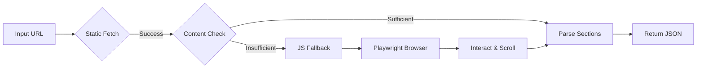

<div align="center">

# 🌐 Universal Website Scraper

### A production-ready web scraper with intelligent JS rendering fallback


</div>

---

## ✨ Features

<div align="center">

| 🎯 Smart Scraping | 📊 Rich Extraction | ⚡ Interactive |
|:----------------:|:-----------------:|:--------------:|
| • Static-first approach<br>• Automatic JS fallback<br>• Playwright integration | • Semantic sections<br>• Metadata & images<br>• Links, lists & tables | • Auto-click tabs<br>• Infinite scroll<br>• Pagination (depth ≥ 3) |

</div>

---

## 🚀 Quick Start

### One-Command Setup
```bash
chmod +x run.sh
./run.sh
```

🎉 Server starts at **http://localhost:8000**

### Manual Installation
```bash
# Clone the repository
git clone https://github.com/kirtygupta/lyftr-ai-scraper.git
cd lyftr-ai-scraper

# Create virtual environment
python -m venv .venv
source .venv/bin/activate  # Mac/Linux
# .venv\Scripts\activate   # Windows

# Install dependencies
pip install -r requirements.txt
python -m playwright install

# Start the server
python -m uvicorn app.main:app --reload --host 0.0.0.0 --port 8000
```

---

## 📁 Project Structure
```
lyftr-ai-scraper/
├── 📂 app/
│   ├── main.py              # FastAPI application & routes
│   ├── scraper.py           # Core scraping logic with JS fallback
│   ├── parsers.py           # HTML parsing & section extraction
│   └── utils.py             # Helper utilities
├── 📂 templates/
│   └── index.html           # Frontend JSON viewer UI
├── 📂 static/
│   └── style.css            # UI styling
├── requirements.txt         # Python dependencies
├── run.sh / run.bat        # Startup scripts
├── capabilities.json        # Feature checklist
├── design_notes.md         # Technical documentation
└── README.md               # You are here!
```

---

## 🔧 API Endpoints

### `GET /healthz`
Health check endpoint

**Response:**
```json
{
  "status": "ok"
}
```

### `POST /scrape`
Scrape and extract structured content from a URL

**Request:**
```json
{
  "url": "https://example.com"
}
```

**Response:**
```json
{
  "result": {
    "url": "https://example.com",
    "scrapedAt": "2025-12-07T10:30:00Z",
    "meta": {
      "title": "Example Domain",
      "description": "Example site description",
      "language": "en",
      "canonical": "https://example.com"
    },
    "sections": [
      {
        "id": "hero-section-0",
        "type": "section",
        "label": "Welcome to Example",
        "sourceUrl": "https://example.com",
        "content": {
          "headings": ["Welcome"],
          "text": "This domain is for use in...",
          "links": [{"text": "More info", "href": "https://example.com/more"}],
          "images": [{"src": "/banner.jpg", "alt": "Banner"}],
          "lists": [["Feature 1", "Feature 2"]],
          "tables": []
        },
        "rawHtml": "<section>...</section>",
        "truncated": false
      }
    ],
    "interactions": {
      "clicks": ["button[aria-label='Load more']"],
      "scrolls": 3,
      "pages": ["https://example.com"]
    },
    "errors": []
  }
}
```

---

## 🧠 How It Works

---

### 🚦 Scraping Pipeline

| Stage | Purpose |
|-------|---------|
| 📡 **Static Fetch** | Lightning-fast retrieval using `httpx` |
| 🔍 **Content Analysis** | Ensures enough meaningful content (> 400 chars, ≥ 2 sections) |
| 🚀 **JS Fallback** | Automatically activates Playwright for JS-heavy pages |
| 🎯 **Smart Interaction** | Auto clicks, scrolls, and pagination for deeper extraction |
| 📊 **Section Extraction** | Converts HTML into well-structured JSON sections |
| ✅ **Quality Verification** | Final cleanup and validation before response |

---

### 🧩 Section Detection Strategy

| Technique | What It Does |
|----------|---------------|
| Semantic Element Recognition | Prioritizes `<header>`, `<nav>`, `<main>`, `<section>`, `<article>`, `<footer>` |
| Heading-Based Grouping | Uses titles to divide long pages into logical chunks |
| Automatic Labeling | Names sections using headings or first 5–7 meaningful words |
| Smart HTML Truncation | Keeps responses compact while preserving context |

---

## 🌐 Tested Websites

| Type | URL | Notes |
|------|-----|-------|
| 📄 **Static** | [Wikipedia AI Article](https://en.wikipedia.org/wiki/Artificial_intelligence) | Rich semantic markup |
| 📚 **Documentation** | [MDN JavaScript Docs](https://developer.mozilla.org/en-US/docs/Web/JavaScript) | Multi-section content |
| ⚡ **JS-Heavy** | [Vercel Homepage](https://vercel.com/) | Requires JS rendering |
| 📰 **Pagination** | [Hacker News](https://news.ycombinator.com/) | Pagination depth ≥3 |

---

## 🦋 Screenshots


---

## ⚙️ Configuration

Customize behavior in `app/scraper.py`:
```python
JS_FALLBACK_THRESHOLD = 400      # Min characters before JS fallback
MAX_PAGINATION_DEPTH = 3         # Max pages/scrolls to follow
RAW_HTML_TRUNCATE = 1000         # Characters per section HTML
PLAYWRIGHT_TIMEOUT = 30000       # Browser timeout (ms)
```

---

## 📊 Performance Benchmarks

| Metric | Static Sites | JS Sites |
|--------|-------------|----------|
| ⚡ Response Time | 2–5 seconds | 10–20 seconds |
| 💾 Memory Usage | ~50–100 MB | ~200–300 MB |
| 🎯 Accuracy | 95%+ | 90%+ |

---

## 🧪 Running Tests
```bash
# Install test dependencies
pip install pytest pytest-asyncio

# Run test suite
pytest tests/ -v
```

---

## 👤 Author: **Kirty Gupta**

---

<div align="center">

### 💙 Built with passion for Lyftr AI

**If you find this project helpful, please ⭐ star the repository!**

---


</div>
